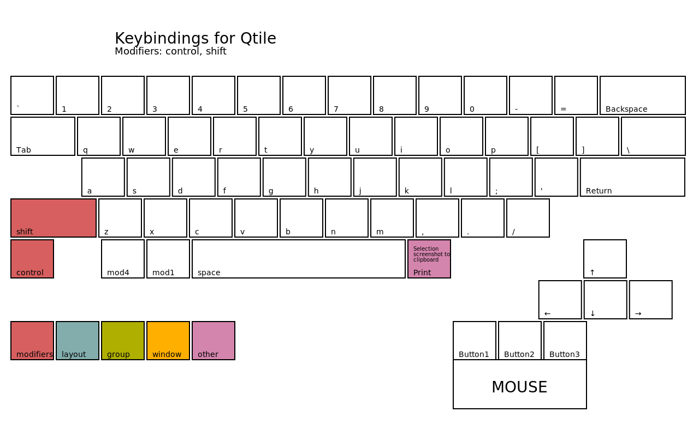
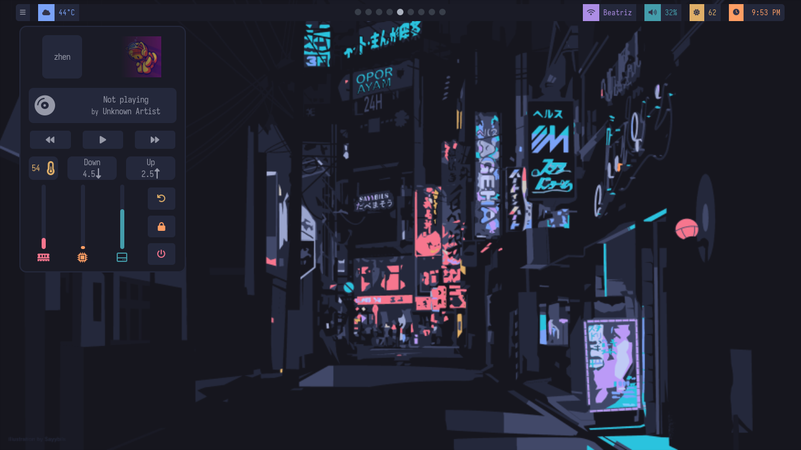

# Dotfiles

<cite>My personal qtile and polybar configuration using <a href="https://github.com/joshdick/onedark.vim">onedark</a> color scheme.</cite>

## Contents

#### 1. <a href="#cameramedia">:camera: Media</a>
><h5>1.1 <a href="#keybinds">Keybinds</a></h5>
><h5>1.2 <a href="#showcase">Showcase</a></h5>
#### 2. <a href="#keyboardinstallation">:keyboard:Installation</a>
><h5>2.1 <a href="#requeriments">Requeriments</a></h5>
><h5>2.2 <a href="#arch-linux">Arch Linux</a></h5>
><h5>2.3 <a href="#other-distros">Other distros</a>	</h5>
><h5>2.4 <a href="#preparation">Preparation</a></h5>
#### 3. <a href="#penresources">:pen:Resources</a>

## :camera:Media
### Keybinds

#### mod4
 <br>
##### mod4 + shift
 <br>
##### mod4 + control
 <br>
#### control
 <br>
##### control + shift
 <br>
#### shift
 <br>
#### no modifier
 <br>

### Showcase



## :keyboard:Installation

<!-- Requeriments {{{ -->
### Requeriments

<div class="grid">

<div>
<h4><a href="https://github.com/haikarainen/light">Light</a></h4>
<cite>GNU/Linux application to control backlights</cite>
</div>

<div>
<h4><a href="https://github.com/cdemoulins/pamixer">Pamixer</a></h4>
<cite>Pulseaudio command line mixer</cite>
</div>

<div>
<h4><a href="https://github.com/altdesktop/playerctl">Playerctl</a></h4>
<cite>mpris media player command-line controller for vlc, mpv, RhythmBox, web browsers, cmus, mpd, spotify and others.</cite>
</div>

<div>
<h4><a href="https://github.com/qtile/qtile">Qtile</a></h4>
<cite>A full-featured, hackable tiling window manager written and configured in Python</cite>
</div>

<div>
<h4><a href="https://github.com/yshui/picom">Picom</a></h4>
<cite>A lightweight compositor for X11</cite>
</div>

<div>
<h4><a href="https://github.com/davatorium/rofi">Rofi</a></h4>
<cite>Rofi: A window switcher, application launcher and dmenu replacement</cite>
</div>

<div>
<h4><a href="https://wiki.gnome.org/action/show/Apps/Files?action=show&redirect=Apps%2FNautilus">Nautilus</a></h4>
<cite>Also known as Nautilus. Provides the user with a simple way to navigate and manage files.</cite>
</div>

<div>
<h4><a href="https://github.com/fish-shell/fish-shell">Fish shell</a></h4>
<cite>The user-friendly command line shell.</cite>
</div>

<div>
<h4><a href="https://github.com/polybar/polybar">Polybar</a></h4>
<cite>A fast and easy-to-use status bar</cite>
</div>
<div>
<h4><a href="https://github.com/alacritty/alacritty">Alacritty</a></h4>
<cite>A cross-platform, OpenGL terminal emulator.</cite>
</div>

<div>
<h4><a href="https://github.com/dunst-project/dunst">Dunst</a></h4>
<cite>Lightweight and customizable notification daemon</cite>
</div>

<div>
<h4><a href="https://github.com/elkowar/eww">Eww</a></h4>
<cite>ElKowars wacky widgets</cite>
</div>

<div>
<h4><a href="https://github.com/Roger/escrotum">Escrotum</a></h4>
<cite>Linux screen capture using pygtk, inspired by scrot</cite>
</div>

<div>
<h4><a href="https://github.com/python/cpython">Python3</a></h4>
<cite>The Python programming language</cite>
</div>

</div>
<br>
<small>And obviously git</small>
<!-- }}} -->

### Arch Linux
You'll need an Aur Helper, like <a href="https://github.com/Jguer/yay">Yay</a> or <a href="https://github.com/Morganamilo/paru">Paru</a>.

In case you're using Yay, you can copy the following command:
```bash
yay -S polybar eww-git rofi-git escrotum-git
```
For the rest of the requirements, you can install them via Pacman
```bash
sudo pacman -S light pamixer playerctl qtile picom nautilus fish alacritty dunst python3 python-pip
```
### Other distros
I don't know the equivalent of the name of the packages for each distribution, I recommend that you read all the links in the list of <a href="#requeriments">requirements</a>.
<br>
If you want to add instructions from a certain distro, feel free to make a pull request

### Preparation

##### .config folder structure
```
~/dotfiles/config
├─eww
│ ├─eww.scss
│ ├─userIMG
│ └─eww.yuck
├─rofi
│ └─config.rasi
├─lite-xl
│ ├─fonts
│ │ ├─nonicons.ttf
│ │ └─iosevka-regular.ttf
│ ├─plugins
│ │ ├─pdfview
│ │ ├─languages
│ │ ├─nonicons
│ │ ├─autoinsert
│ │ ├─console
│ │ ├─smallclock
│ │ └───colorpreview
│ ├─colors
│ │ └─onedark.lua
│ └─init.lua
├─picom
│ └─picom.conf
├─gtk-3.0
│ └─settings.ini
├─polybar
│ ├─workspaces.py
│ ├─menu
│ ├─volumeScript
│ ├─config.ini
│ ├─weather.py
│ └─playerctl.py
├─dunst
│ └─dunstrc
├─fish
│ ├─conf.d
│ ├─functions
│ │ └─fish_prompt.fish
│ ├─config.fish
│ └─fish_variables
├─alacritty
│ └─alacritty.yml
└───qtile
    ├─autostart.sh
    └─config.py
```

Weather script needs <a href="https://github.com/psf/requests">requests</a> library, install it via pip:
```bash
pip3 install requests
```
Change your shell to /bin/fish
```bash
chsh
```

then clone the repository...
```bash
git clone https://github.com/adrian26o/dotfiles.git
```
and copy each folder to your home path. <br>
Don't forget to rename the name of the following folders:
> fonts => .fonts <br>
> config => .config <br>
> themes => .themes <br>
> bin => .bin <br>

and after this, i recommend reboot. <br>
Enjoy :star:
<!-- Thanks section {{{ -->
## :pen:Resources

<div class="grid">
<div>

<h4>	<a href="https://gitlab.com/jschx/ufetch">ufetch</a>	</h4>


</div>

<div>

<h4>	<a href="https://github.com/Theory-of-Everything/nii-nvim/tree/main">nii-nvim</a>	</h4>
 

</div>

<div>

<h4>	<a href="https://github.com/davatorium/rofi-themes/blob/master/User%20Themes/onedark.rasi">Rofi Onedark theme</a>	</h4>


</div>

<div>

<h4><a href="https://gist.github.com/r-darwish/f8bb21a6c89a02c4bef76cc38bddad39">Alacritty Onedark theme</a></h4>


</div>

<div>

<h4>	<a href="https://github.com/lonr/adwaita-one-dark">Adwaita Onedark Theme</a></h4>


</div>

<div>

<h4>	Lite XL		</h4>
<a href="https://github.com/lite-xl/lite-xl"><b>Editor</b></a><br>
<a href="https://github.com/lite-xl/lite-xl-plugins"><b>Plugins</b></a><br>
<a href="https://github.com/lite-xl/lite-xl-colors/blob/master/colors/onedark.lua"><b>Onedark theme</b></a>


</div>

<div>
<h4><a href="https://github.com/UnnatShaneshwar/OneDarkWallpapers">Wallpapers</a></h4>

</div>

</div>


<!-- }}} -->
